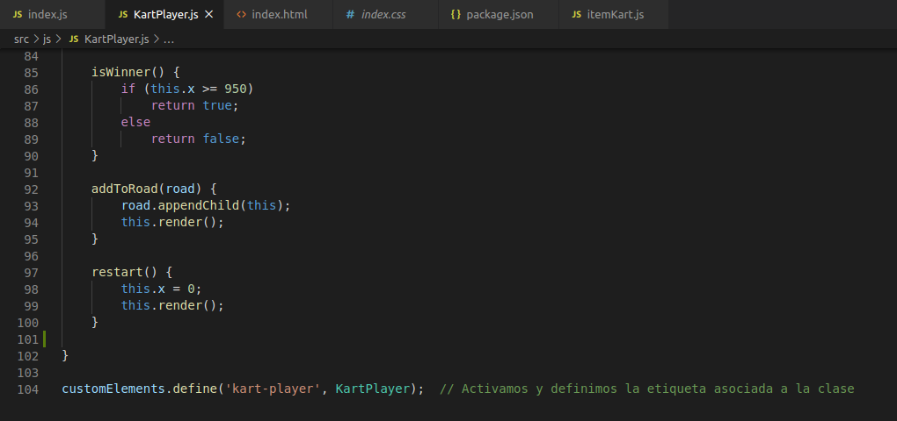

# dsi-p5-mkart-alu0100833010

_Práctica 5.  WebComponents._

## Descripción de la Práctica  dsi-p5-mkart.

### ¿WebComponents? 

El objetivo de la práctica es crear una pequeña carrera de **Mario Kart**. Para ello, utilizaremos **WebComponents** para encapsular 
conceptos clave de la práctica, como los kart de cada personaje. De esta forma, podríamos crear un _WebComponent_ llamado `KartPlayer`.
Este componente es similar al concepto de clases en programación (de hecho, extiende de `HTMLElement`), y se recomienda que se vea 
como una extensión para crear una etiqueta _HTML_ propia y personalizada a la que le daremos funcionalidad y apariencia. 

La idea es que nuestra etiqueta HTML `<kart-player>` (o componente `KartPlayer`), incluya, maneje y controle datos del kart para encapsular 
su funcionamiento y hacernos más fácil y cómodo trabajar con él, sin que repercuta con el resto de la página.

## Comenzando

### 1. Crea un proyecto en _Parcel_.

Como en prácticas anteriores, para comenzar crearemos un proyecto con Parcel para poder trabajar y realizar la práctica. Para ello 
comenzamos creando la estructura del proyecto .

#### Pasos para crear el proyecto.

* **Scaffolding** 

  Creamos las carpetas:
  ```
  mkdir -p nombre-repo/src/{css,js,assets}
  ```
  Nos situamos en el repo:
  ```
  cd nombre-repo
  ```
* **Git**

  Inicializamos el repo con git:
  ```
  git init
  git remote add origin...
  touch .gitignore
  touch README.md
  ```
* **NPM**

  Inicializamos el repo con npm:
  ```
  npm init -y
  ```
* **Instalación de ParcelJS**
  ```
  // Instalamos parcel en nuestro proyecto.
  npm install -D parcel-bundler
  
  // Punto de entrada para parcel.
  npx parcel src/index.html
  ```
* **Linters**
  ```
  npm install -D eslint
  ```
* **Formateador de código: Prettier**
  ```
  // Configurar nuestro proyecto para Prettier
  npm install -D prettier
  
  // Plugins para evitar conflictos entre Prettier y ESLint.
  npm install -D eslint-config.prettier eslint-plugin-prettier
  ```
  
  Tras esto, la estructura final del proyecto quedaría:
  
  
  
### 2. Código _HTML_.

La estrucutura de `index.html` es la siguiente:

 
 
El código de `index.html` cuenta con la clase _race_ que indica en que parte de la página estará situada la carrera y dentro de
dicho elemento se encuentra la clase _road_, donde introduciremos los jugadores a la carrera mediante _Javascript_.

```
<div class="buttons">
  <button class="start">Start</button>
  <button class="restart">Restart</button>
</div>
```

También hay dos botones, uno para comenzar la carrera, y el otro, una vez finalizada la carrera, volver a iniciarla.

### 3. Código _CSS_.

* **.race** y **.road**:

 
 
* **.buttons**:


* **PostCSS:**

En esta práctica tambien se ha hecho uso de **PostCSS**, que son plugins de _Javascript_ que transforman el código _CSS_. 

Para incorporarlo a nuestro proyecto, como hacemos uso de _Parcel_, el paquete de postcss ya está incorporado, sin embargo debemos
instalar los paquetes que deseemos mediante **npm** utilizando los siguientes comandos:

```
$ npm install -D autoprefixer postcss-clean postcss-font-magician postcss-mixins postcss-nesting
```
Una vez instalados los paquetes, creamos un archivo de configuración `.postcssrc`.

### 4. Código _Javascript_.

Utilizando _Javascript_, creamos el componente **KartPlayer**:

 
 
* `index.js`:

 
 
En `index.js` se desarrolla la avtividad general del juego. 

 
 
Sigue un enfoque funcional, es decir, con pequeñas funciones flecha.

* `KartPlayer.js`:


En el componente `KartPlayer.js` creamos el shadowDOM para encapsular el HTML y CSS del componente y que no afecte a otros
karts. 

Además del código proporcionado inicialmente, se han añadido más estilos para las funciones que determinan cuando un kart es
ganador o perdedor.


La función `render()` se encarga de mostrar los jugadores.

La función `inc()` se encarga de incrementar la cantidad a la que avanza el kart en el eje x, junto con la función `setSpeed()`
que se encarga de asignar aleatoriamente la velocidad que toma el kart.


Las funciones `win()` y `lose()` se encargan de mostrar el kart ganador y los karts perdedores.


 
Por último, la función `isWinner()` comprueba cuando un kart es ganador. Como los karts avanzan en el eje x y el tamaño de la
carrera es 950, cuando la x sea mayor o igual a dicha cantidad, ese kart será el ganador.

La función `addToRoad()`, tal y como su nombre indica, añade los karts a la carretera y la función `restart()` que se encarga
de reiniciar la carrera asignando la x de nuevo a 0.

### 5. Publicación en _gh-pages_.
 
Para publicar nuestro proyecto en **gh-pages**, ejecutamos los siguientes comandos:
```
$ npx parcel build src/index.html --no-minify
$ npx parcel build src/index.html --no-source-maps --detailed-report
$ npx parcel build src/index.html --public-url /dsi-p5-mkart-alu0100833010/ -d build
$ npx gh-pages -d build
```


Enlace:  https://ull-esit-dsi-1920.github.io/dsi-p5-mkart-alu0100833010/
